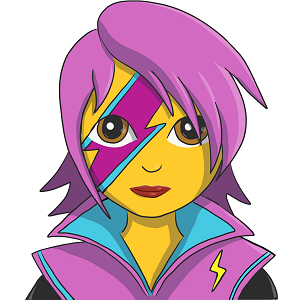

  
  
  
  
  
  <h1 align="center">Adventure Text Game Creator</h1>

Build your own adventure

# The Project

This project aims to develop an `Adventure Text Game Creator`. The application will allow users to create their own `Adventure Text Game`.

An `Adventure Text Game` is composed by a set of `Cards` linked to each other that allow the user to follow a story. Each `Card` shows a piece of narrative `Content` and offers different `Options` for the user to chose from, the decision affects the `Flow` of the story. Based on the the decision, the story will advance following different `Flows`, with different developments and endings for each of the `Flows`.

## Iterations

1. Adventure Text Game Interface:
   - The user can interact and play a story.
   - Story stored in a JSON.
   - No BE.

This will be reused in the future as a previewer for the Creator Mode and to play stories. This will feed the research into the DB structure.

2. Adventure Text Game Creator:
   - The user can create his/her own story.
   - The user can preview the story.

# Technology

The reasons behind the technology chosen for this project.

#### First time usage

- Vite: Good alternative to CRA. Fast and simple.
- Vitest: Faster version of Jest.
- Material-UI: No previous experience. Most established Component Library. Practice implementation.
- Emotion: First time using this technology. Practice implementation.

#### Already used in the past

- TypeScript: Practice types system and advanced typing.
- React: Second side project using React. The main goal is to practice best practices and usage patterns.

# Motivations
